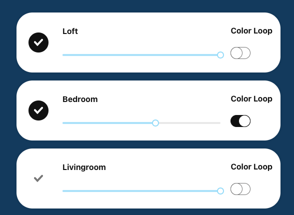
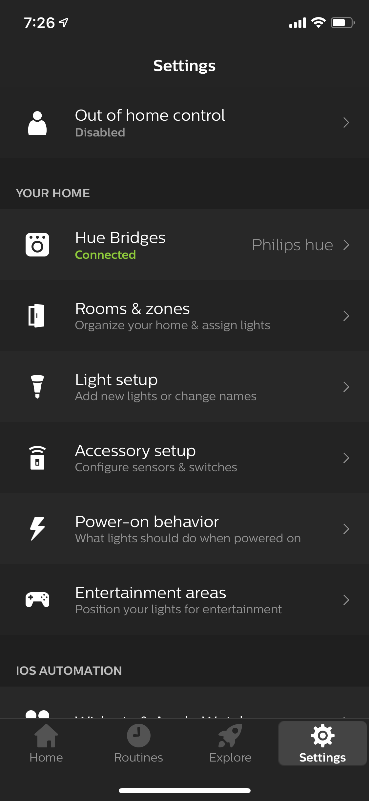

# Project Title

## Hue Home Lights App 

Here is a project I started so that I could learn React and the Hue bridge api.  

This app will query the Hue bridge for all groups then filter out the group type of 'room' then display those rooms in a room component.  Hue-home-lights app is currently using the Gestalt component library from Pinterest for most of the atom controls and the rc-slider slide control to change the brightness.  




## Getting Started

The instructions below will get you a copy of the project running on your local machine for development. 

**Cloning and running the project**
```zsh
git clone https://github.com/vherrin/hue-home-lights.git
yarn 
yarn start
``` 

### Prerequisites

First you need to find the hue bridge ip so that you can create a userId.  The user This can be done several ways. I will walk you through the hue app version to get the ip but provide some links to the other ways I have discovered.

Open the hue app on your mobile device.  The pictures show the iPhone version.
  - Go to settings tab
  - Select Hue Bridges
  - Select the information icon and get the ip 

<div> </div>
<p float="left">
  
  
  
</p>

### Other ways to discover

This link will discover your hue bridge and display the IP
https://discovery.meethue.com/

This site shows several ways to discover
https://developers.meethue.com/develop/application-design-guidance/hue-bridge-discovery/


### Getting to know the Hue bridge API 

Once you get the IP then you need to generate a user name so that you can use the Hue bridge API.  This is simple enough and you can find the instructions in the link below.  Basically it requires you to hit a specific call to the bridge when the bridge button has been pushed to generate a user name.  There is a simple test web app built into every Hue bridge which lets you directly input commands and send them to the lights.  I personally used insomnia the free version to create and save off the api calls from learning and testing.

Here is a quick picture of the built-in bridge test app


[Getting started with Hue development](https://developers.meethue.com/develop/get-started-2/)

[Insomnia API Client](https://insomnia.rest/)

### Future Work Planned

* add scenes so that each room can drill down and set a defined scene
* add color loop to a specific light and not just a room
* visual updates and clean-up

## Authors

* *Vince Herrin* - *Initial work* - [Vince](https://github.com/vherrin)

## License

This project is licensed under the MIT License - see the [LICENSE.md](LICENSE.md) file for details


